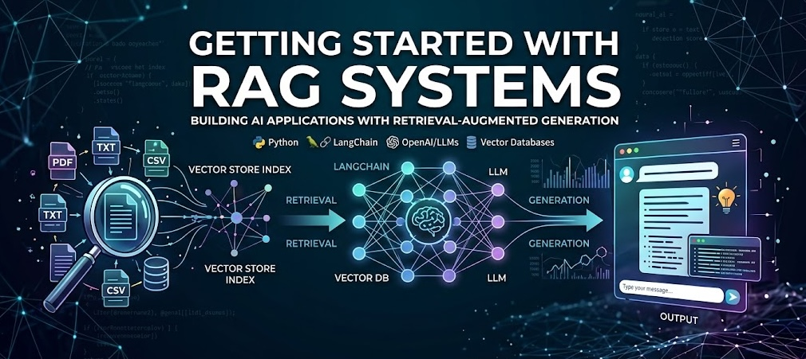

# Getting Started with RAG Systems



Welcome to the official repository for the **"Getting Started with RAG Systems"** masterclass, presented at the **Amrita School of AI**.

This repository contains all the code, notebooks, and resources you will need to follow along with the session and build your own Retrieval-Augmented Generation (RAG) applications.

## 📖 About the Masterclass

Large Language Models (LLMs) are powerful, but they have limitations like hallucination and restricted knowledge bases. **Retrieval-Augmented Generation (RAG)** solves this by connecting LLMs to your custom data, enabling factual, up-to-date, and domain-specific AI systems.

In this deep dive, we transition from the foundational concepts of vectorizing data to building advanced, resilient architectures.

## 📚 Curriculum 

This repository is structured around the following core modules:

### Module 1: Intro to RAG
* Understanding RAG architecture.
* Standard Generation vs. Retrieval-Augmented Generation.
* Why RAG is the foundation of modern AI applications.

### Module 2: Vector Embeddings & Similarity Scores
* How text is converted into numbers (embeddings).
* Working with embedding models and vector databases.
* The math behind cosine similarity and distance metrics.

### Module 3: Self RAG
* Moving beyond basic, naive retrieval.
* Training/prompting models to reflect on their own retrieved passages.
* Deciding relevance before generating a final response.

### Module 4: Corrective RAG (CRAG)
* Advanced techniques for building robust AI.
* Evaluating retrieved documents automatically.
* Implementing fallback mechanisms (e.g., triggering web searches when internal retrieval fails).

## 🚀 Getting Started

To follow along with the code in this repository, you will need to set up your local environment.

### Prerequisites
* Python 3.9+
* Git
* LangChain and LangGraph

### Setup Instructions

1. **Clone the repository:**
```bash
   git clone SauravP97/rag-systems-masterclass
   cd rag-systems-masterclass
```

## References

  1. Self RAG paper: https://arxiv.org/pdf/2310.11511
  2. Corrective RAG paper: https://arxiv.org/pdf/2401.15884
  3. My Youtube channel: [View](https://www.youtube.com/@saurav_prateek_)
  4. Video on Self RAG: https://youtu.be/H9zMp5wzQjc?si=eAJgFaZWabGj8P6k
  5. Video on Corrective RAG: https://youtu.be/vAJqCDaU9Oc?si=vsAXneR3shlWL9mj